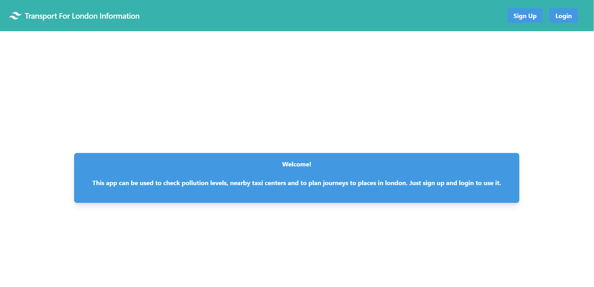

<h1>Transport For London Information</h1>

**This app allows the user to sign up/login to a site and then find pollution levels, show nearby taxis on a map along with information about them and plan a trip to/from London using the TFL API found [here](https://api.tfl.gov.uk).  It uses Node.js on the server side and React and React Router on the client side, along with Tailwind-CSS for the styling.  Other npm packages used include:**

- react-moment
- react-particles-webgl
- react-datepicker
- google-maps-react
- axios

**To use the app, clone this repo then navigate into the "client" and "server" folders in separate terminals and run `npm install` in each one. Then run `npm run start` and navigate to `localhost:3000` to use the app.  You will need to create a `.env` file and use a separate mongo database URI and Google Maps API Key for the app to work properly.**

